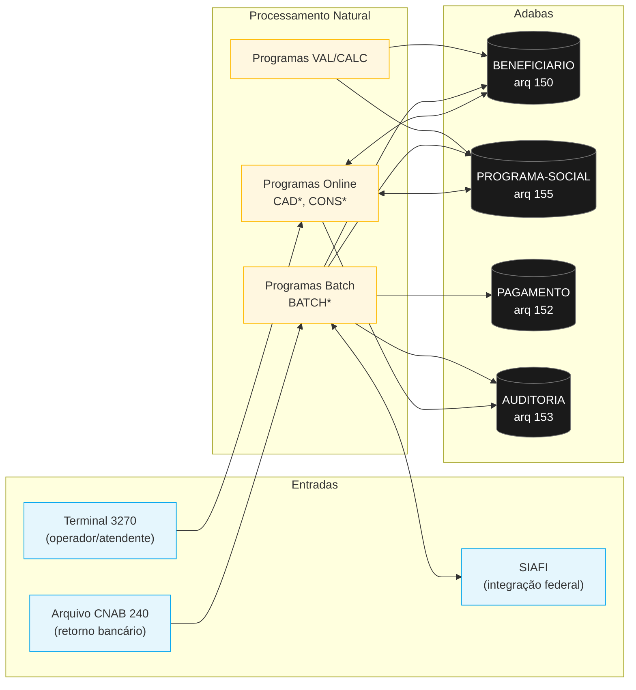

<!-- markdownlint-disable MD013 MD025 MD026 MD028 MD029 MD034 MD040 MD051 MD060 -->

# Mapa de Dependências — SIFAP Legado

  

> 🗺 **Você está aqui:** [Kit PT-BR](../README.md) → [Estágio 1](README.md) → **dependency-map**

> **Para quem é isto?** Este é um **artefato preenchido pelo time** durante o Estágio 1 (Arqueologia).
>
> **O que você terá ao final do estágio:**
>
> 1. Este documento totalmente preenchido com os dados reais do legado SIFAP
> 2. Rastreabilidade para `01-arqueologia/legado-sifap/` (programas `.NSN` e DDMs)
> 3. Base de evidência usada nas EARS do Estágio 2 (`source_legacy:`)
>
> 📘 **Guia passo a passo:** [`GUIDE.md`](GUIDE.md).

> Use diagramas Mermaid para mapear as dependências entre programas Natural e DDMs Adabas.
> O objetivo é visualizar "quem chama quem" e "quem lê/escreve o quê".

## Como descobrir dependências

- Use `grep` ou Copilot Chat para listar todas as ocorrências de `CALLNAT` nos 15 arquivos `.NSN`.
- Prompt útil: _"Liste todas as ocorrências de CALLNAT nestes arquivos e desenhe um diagrama Mermaid."_
- Para leitura/escrita em DDMs: procure por `READ`, `READ LOGICAL`, `STORE`, `UPDATE`, `DELETE`.

## Diagrama de Dependências entre Programas

```mermaid
flowchart TD
    classDef online fill:#E5F6FD,stroke:#00A4EF,color:#0A0A0A
    classDef batch fill:#FFF7E0,stroke:#FFB900,color:#0A0A0A
    classDef query fill:#F1F8E3,stroke:#7FBA00,color:#0A0A0A
    classDef sub fill:#FBE9F4,stroke:#E81D62,color:#0A0A0A
    classDef ddm fill:#1A1A1A,stroke:#737373,color:#FFFFFF

    subgraph "Online (terminal 3270)"
        CADBENF["CADBENEF.NSN<br/>Cadastro beneficiário"]:::online
        CADDEPEND["CADDEPEND.NSN<br/>Cadastro dependentes"]:::online
        CADPROG["CADPROG.NSN<br/>Cadastro programa social"]:::online
        CONSBENF["CONSBENF.NSN<br/>Consulta beneficiário"]:::online
    end

    subgraph "Batch noturno"
        BATCHPGT["BATCHPGT.NSN<br/>Geração ciclo pagamento"]:::batch
        BATCHCON["BATCHCON.NSN<br/>Conciliação CNAB 240"]:::batch
        BATCHREL["BATCHREL.NSN<br/>Geração relatórios"]:::batch
    end

    subgraph "Subprogramas / Validação"
        VALBENEF["VALBENEF.NSN<br/>Valida regras beneficiário"]:::sub
        VALDOCS["VALDOCS.NSN<br/>Valida documentação"]:::sub
        VALELEG["VALELEG.NSN<br/>Valida elegibilidade"]:::sub
        CALCBENF["CALCBENF.NSN<br/>Calcula valor benefício"]:::sub
        CALCCORR["CALCCORR.NSN<br/>Correção monetária IPCA"]:::sub
        CALCDSCT["CALCDSCT.NSN<br/>Calcula descontos"]:::sub
    end

    subgraph "Relatórios"
        RELPGT["RELPGT.NSN<br/>Relatório pagamentos"]:::query
        RELAUDIT["RELAUDIT.NSN<br/>Relatório auditoria"]:::query
    end

    subgraph "DDMs Adabas"
        DBENEF[("BENEFICIARIO<br/>arq 150")]:::ddm
        DPGTO[("PAGAMENTO<br/>arq 152")]:::ddm
        DPROG[("PROGRAMA-SOCIAL<br/>arq 155")]:::ddm
        DAUD[("AUDITORIA<br/>arq 153")]:::ddm
    end

    %% Cadastros
    CADBENF -->|CALLNAT| VALBENEF
    CADBENF -->|CALLNAT| VALDOCS
    CADBENF -->|STORE/UPDATE| DBENEF
    CADBENF -->|STORE| DAUD

    CADDEPEND -->|UPDATE| DBENEF
    CADDEPEND -->|STORE| DAUD

    CADPROG -->|STORE/UPDATE| DPROG
    CADPROG -->|STORE| DAUD

    CONSBENF -->|READ| DBENEF
    CONSBENF -->|READ| DPROG
    CONSBENF -.->|CO não logado desde 2010| DAUD

    %% Batch pagamento
    BATCHPGT -->|CALLNAT| VALELEG
    BATCHPGT -->|CALLNAT| CALCBENF
    BATCHPGT -->|CALLNAT| CALCDSCT
    BATCHPGT -->|READ LOGICAL| DBENEF
    BATCHPGT -->|READ| DPROG
    BATCHPGT -->|STORE| DPGTO
    BATCHPGT -->|STORE| DAUD

    %% Subprogramas internos
    VALELEG -->|CALLNAT| VALDOCS
    VALELEG -->|READ| DPROG
    CALCBENF -->|CALLNAT| CALCCORR
    CALCBENF -->|READ| DPROG
    CALCDSCT -->|READ| DPGTO

    %% Conciliação
    BATCHCON -->|UPDATE| DPGTO
    BATCHCON -->|STORE| DAUD

    %% Relatórios
    BATCHREL -->|READ| DPGTO
    RELPGT -->|READ| DPGTO
    RELAUDIT -->|READ| DAUD
```

> Cobertura: **15/15 programas + 4/4 DDMs**.

## Diagrama de Fluxo de Dados (DDMs)

## Tabela de Dependências

| Programa | Chama (CALLNAT) | Lê (READ) DDMs | Escreve (STORE/UPDATE) DDMs | Observações |
| -------- | --------------- | -------------- | --------------------------- | ----------- |
| CADBENEF.NSN | VALBENEF, VALDOCS | BENEFICIARIO | BENEFICIARIO, AUDITORIA | Operações I/A/C via tela 3270. |
| CADDEPEND.NSN | — | BENEFICIARIO | BENEFICIARIO (PE `DA`), AUDITORIA | Máx 5 deps por titular. |
| CADPROG.NSN | — | PROGRAMA-SOCIAL | PROGRAMA-SOCIAL, AUDITORIA | Contém constante mágica 0.347215 (L65). |
| CONSBENF.NSN | — | BENEFICIARIO, PROGRAMA-SOCIAL | — | **Não escreve em AUDITORIA** desde 2010. |
| VALBENEF.NSN | — | BENEFICIARIO | — | Subprograma de validação de regras de status. |
| VALDOCS.NSN | — | BENEFICIARIO | — | CPF prefixo bypass (L122-130). |
| VALELEG.NSN | VALDOCS | BENEFICIARIO, PROGRAMA-SOCIAL | — | Região 99 = bypass total (L79-83). |
| CALCBENF.NSN | CALCCORR | PROGRAMA-SOCIAL | — | Cálculo principal; arredondamento por truncamento. |
| CALCCORR.NSN | — | PROGRAMA-SOCIAL | — | Tabelas IPCA hardcoded 2010-2012 apenas. |
| CALCDSCT.NSN | — | PAGAMENTO | — | Tipo desconto 'C' órfão (declarado, nunca tratado). |
| BATCHPGT.NSN | VALELEG, CALCBENF, CALCDSCT | BENEFICIARIO, PROGRAMA-SOCIAL | PAGAMENTO, AUDITORIA | Pipeline principal de geração mensal de pagamentos (~180M registros). |
| BATCHCON.NSN | — | PAGAMENTO (CNAB 240 IO) | PAGAMENTO, AUDITORIA | Conciliação; loop infinito potencial em estornos. |
| BATCHREL.NSN | — | PAGAMENTO | — | Arredondamento `+0.005` divergente do CALCBENF. |
| RELPGT.NSN | — | PAGAMENTO, BENEFICIARIO | — | Relatório operacional. |
| RELAUDIT.NSN | — | AUDITORIA, BENEFICIARIO | — | **CPF impresso sem máscara — violação LGPD**. |

## Dependências Circulares

- Nenhuma dependência circular detectada entre os 15 programas.

## Programas Órfãos

- **Nenhum programa é totalmente órfão**, mas alguns têm acoplamento mínimo:
    - `CADDEPEND.NSN` não é chamado por nenhum outro programa (apenas invocado por operador via tela 3270).
    - `CONSBENF.NSN`, `RELPGT.NSN`, `RELAUDIT.NSN` são "folhas" (não chamam outros .NSN).
- **Subprogramas só fazem sentido em conjunto**: `VALBENEF`, `VALDOCS`, `VALELEG`, `CALC*` dependem dos chamadores online/batch.

## Pontos de Entrada

1. **Terminal 3270 (operador)** → `CAD*`, `CONS*`
2. **Scheduler JCL noturno** → `BATCHPGT` (D+1 do fim do mês), `BATCHCON` (diário), `BATCHREL` (mensal)
3. **Job manual** → `RELPGT`, `RELAUDIT` (sob demanda)

---

### Continuar a leitura

<table width="100%">
<tr>
<td width="50%" valign="top" align="left">
<strong>← ANTERIOR</strong> 
<a href="business-rules-catalog.md"><strong>business-rules-catalog.md</strong></a> 
Catálogo de regras.
</td>
<td width="50%" valign="top" align="right">
<strong>PRÓXIMO →</strong> 
<a href="discovery-report.md"><strong>discovery-report.md</strong></a> 
Síntese final.
</td>
</tr>
</table>

↑ <a href="README.md">Voltar ao Kit PT-BR</a>

