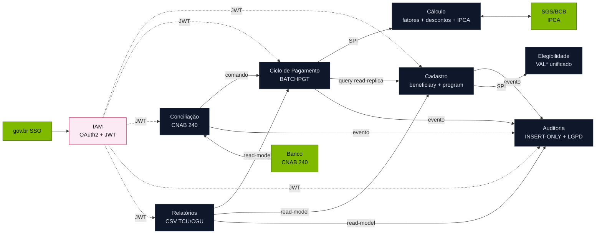

<!-- markdownlint-disable MD013 MD025 MD026 MD028 MD029 MD034 MD040 MD051 MD060 -->

# Mapa de Bounded Contexts — SIFAP 2.0

 

**Time**: Workshop Dourado-02 · **Data**: 27/05/2026 · **Autor**: Software Architect (persona 04)
**Input**: [`../01-arqueologia/discovery-report.md`](../01-arqueologia/discovery-report.md), [`../01-arqueologia/dependency-map.md`](../01-arqueologia/dependency-map.md), [`scope-decisions.md`](scope-decisions.md)

## Avaliações de Hipóteses

### H1 — "Um único contexto Pagamento" — REJEITADA

| Critério | Avaliação | Evidência |
| --- | --- | --- |
| Coesão | Baixa | Mistura cadastro + cálculo + conciliação + auditoria; cada um tem regras independentes (BR-001 vs BR-021 vs BR-025) |
| Acoplamento | Externo elevado | SIAFI, banco, gov.br entrariam todos no mesmo módulo |
| Frequência de mudança | Heterogênea | Cálculo muda raramente (lei); conciliação muda quando layout CNAB evolui (anual); auditoria é estável |

### H2 — "Cadastro Beneficiário separado de Programa Social" — ACEITA

| Critério | Avaliação | Evidência |
| --- | --- | --- |
| Coesão | Alta | Beneficiário tem seu próprio ciclo de vida (CADBENEF + CADDEPEND + CONSBENF); Programa social é metadado paramétrico (CADPROG) |
| Acoplamento | Baixo | Programa social é referenciado por ID; não há "join transacional" entre ambos |
| Frequência de mudança | Distinta | Beneficiário muda diariamente; programa social muda 2-4× por ano |

### H3 — "Auditoria como contexto próprio (não cross-cutting concern)" — ACEITA

| Critério | Avaliação | Evidência |
| --- | --- | --- |
| Coesão | Alta | Regras LGPD + IN-TCU 63/2010 + retenção 10 anos formam um domínio coeso |
| Acoplamento | Baixo | Consome eventos de domínio; não acopla escrita nas outras tabelas |
| Frequência de mudança | Baixa mas crítica | Mudanças regulatórias raras mas obrigatórias |

### H4 — "Conciliação Bancária separada de Ciclo de Pagamento" — ACEITA

| Critério | Avaliação | Evidência |
| --- | --- | --- |
| Coesão | Alta | CNAB 240 + idempotência + dead-letter têm modelo próprio |
| Acoplamento | Médio | Comparte agregado Payment, mas via comandos `markPaid`/`markReturned` |
| Frequência de mudança | Distinta | Layout CNAB muda quando FEBRABAN emite versão; cálculo muda quando lei muda |

### H5 — "Cálculo de Benefício separado de Geração de Ciclo" — ACEITA

| Critério | Avaliação | Evidência |
| --- | --- | --- |
| Coesão | Alta | Cálculo é função pura testável (fatores, descontos, correção); Ciclo é orquestração temporal |
| Acoplamento | Por contrato | Ciclo chama `CalculationService.compute(beneficiary, program, competence) → Money` |
| Frequência de mudança | Distinta | Cálculo muda quando regra de fator muda; Ciclo muda quando calendário muda |

## Bounded Contexts Finais

### 1. Cadastro (`cadastro`)

- **Responsabilidade:** Manter beneficiários, dependentes e programas sociais — fonte da verdade demográfica e paramétrica.
- **Dados sob ownership:** `beneficiary`, `dependent`, `social_program`, `social_program_parameter` (incl. `FATOR-K`, `0.347215`).
- **Interface pública:** REST `/api/v1/beneficiaries`, `/api/v1/social-programs`; eventos `BeneficiaryRegistered`, `BeneficiaryStatusChanged`, `SocialProgramUpdated`.
- **Por que é seu próprio contexto:** Hipótese H2; entidades centrais com ciclo de vida independente. Resolve MYS-005 (DOCUMENTOS-OK), MYS-009 (máscara CPF), MYS-014 (deps 5 vs 10).
- **Mapeamento legado:** `CADBENEF.NSN`, `CADDEPEND.NSN`, `CADPROG.NSN`, `CONSBENF.NSN`; DDMs `BENEFICIARIO`, `PROGRAMA-SOCIAL`.

### 2. Validação & Elegibilidade (`elegibilidade`)

- **Responsabilidade:** Validar CPF, documentação e elegibilidade do beneficiário ao programa.
- **Dados sob ownership:** Tabela de exceções (`cpf_prefix_exception`, `region_exception`) — **explícita** e auditada (resolve BR-003/BR-012/MYS-003/MYS-004).
- **Interface pública:** Funções puras invocadas via SPI por `cadastro` e `pagamento`; endpoint admin `/api/v1/exceptions`.
- **Por que é seu próprio contexto:** Concentra as decisões de segurança hoje espalhadas em `VALBENEF/VALDOCS/VALELEG`. Permite auditoria explícita.
- **Mapeamento legado:** `VALBENEF.NSN`, `VALDOCS.NSN`, `VALELEG.NSN`.

### 3. Cálculo de Benefício (`calculo`)

- **Responsabilidade:** Calcular valor bruto, descontos, correção monetária e líquido. **Função pura testável.**
- **Dados sob ownership:** Tabelas paramétricas: `regional_factor`, `family_factor_bracket`, `income_factor_bracket`, `age_factor_bracket`, `discount_cap_rule`, `contribution_bracket`. Integração externa SGS/BCB para IPCA.
- **Interface pública:** Java SPI `CalculationService.compute(Context) → CalculationResult`; sem REST (chamado internamente).
- **Por que é seu próprio contexto:** Hipótese H5; testável isoladamente com shadow-run vs legado. Concentra MYS-006 (IPCA) e MYS-013 (arredondamento).
- **Mapeamento legado:** `CALCBENF.NSN`, `CALCCORR.NSN`, `CALCDSCT.NSN`.

### 4. Ciclo de Pagamento (`pagamento`)

- **Responsabilidade:** Orquestrar a geração mensal (5º dia útil), persistir `Payment`, gerir máquina de estados (G→P→...→C/E).
- **Dados sob ownership:** `payment`, `payment_cycle`, `payment_status_history`.
- **Interface pública:** REST `/api/v1/payments`, `/api/v1/payment-cycles`; eventos `PaymentGenerated`, `PaymentApproved`, `PaymentRejected`.
- **Por que é seu próprio contexto:** Hipótese H1 rejeitada; pipeline de ~180M pagamentos/mês merece módulo isolado com SLAs próprios.
- **Mapeamento legado:** `BATCHPGT.NSN`; DDM `PAGAMENTO`.

### 5. Conciliação Bancária (`conciliacao`)

- **Responsabilidade:** Importar retornos CNAB 240, casar com `Payment`, gerar divergências e estornos.
- **Dados sob ownership:** `bank_return_file`, `bank_return_record`, `reconciliation_divergence`, `reconciliation_retry`.
- **Interface pública:** REST `/api/v1/reconciliation/*`; eventos `PaymentReconciled`, `PaymentReturned`, `ReconciliationDivergenceDetected`; consome `PaymentGenerated`.
- **Por que é seu próprio contexto:** Hipótese H4; layout CNAB tem ciclo de mudança próprio. Inclui idempotência e DLQ (resolve BR-022 loop).
- **Mapeamento legado:** `BATCHCON.NSN`.

### 6. Auditoria & Compliance (`auditoria`)

- **Responsabilidade:** Trilha imutável (INSERT-ONLY), política de retenção, log LGPD de consultas.
- **Dados sob ownership:** `audit_event` (particionada por mês), `audit_retention_policy`.
- **Interface pública:** Consumidor de **todos** os eventos de domínio; REST de leitura `/api/v1/audit` (com role AUDITOR); job de purge.
- **Por que é seu próprio contexto:** Hipótese H3; regras IN-TCU 63/2010 + Lei 8159/1991 + LGPD são domínio próprio. Resolve MYS-008, MYS-015.
- **Mapeamento legado:** `AUDITORIA.ddm`, `RELAUDIT.NSN`.

### 7. Relatórios (`relatorios`)

- **Responsabilidade:** Geração de relatórios operacionais e regulatórios (TCU/CGU). Read-models projetados.
- **Dados sob ownership:** Views materializadas, CSVs gerados.
- **Interface pública:** REST `/api/v1/reports/*` (assíncrono via task ID); read-only.
- **Por que é seu próprio contexto:** Carga de leitura pesada não pode disputar com escrita transacional. Unifica arredondamento (MYS-013).
- **Mapeamento legado:** `BATCHREL.NSN`, `RELPGT.NSN`.

### 8. Identidade & Autorização (`iam`) — GREENFIELD

- **Responsabilidade:** Autenticação OAuth2 (gov.br SSO), emissão JWT, RBAC com perfis ADM/OPR/CON/AUD/SUP.
- **Dados sob ownership:** `user`, `role`, `permission`, `user_role`.
- **Interface pública:** REST `/api/v1/auth/*`; Spring Security filter chain.
- **Por que é seu próprio contexto:** Não tem equivalente legado (terminal 3270 usava sessão); separar de domínio.
- **Mapeamento legado:** `[GREENFIELD]` — campo `AUDITORIA.EC` (perfil) dá o vocabulário.

## Comunicação Entre Contextos

| De | Para | Mecanismo | Dados |
| --- | --- | --- | --- |
| `cadastro` | `auditoria` | Evento `BeneficiaryRegistered`, `BeneficiaryStatusChanged` | Estado anterior + posterior + actor |
| `cadastro` | `elegibilidade` | SPI síncrona `EligibilityService.canEnroll(beneficiary, program)` | DTO Beneficiary + Program |
| `pagamento` | `calculo` | SPI síncrona `CalculationService.compute(ctx)` | Contexto + parâmetros |
| `pagamento` | `cadastro` | Read-only query (read replica) | Lista de beneficiários ACTIVE |
| `pagamento` | `auditoria` | Evento `PaymentGenerated`, `PaymentApproved`, `PaymentRejected` | Estado anterior + posterior + actor |
| `conciliacao` | `pagamento` | Comando `markPaid(paymentId, ...)` / `markReturned(paymentId, ...)` | Resultado bancário |
| `conciliacao` | `auditoria` | Evento `PaymentReconciled`, `ReconciliationDivergenceDetected` | |
| `relatorios` | `pagamento`, `cadastro`, `auditoria` | Leitura via read-models (projeções CQRS-light) | Read-only |
| `iam` | (todos via filtro Spring Security) | JWT + RBAC | Claims `sub`, `roles` |
| `calculo` | SGS/BCB (externo) | HTTP REST | Série IPCA |
| `conciliacao` | Banco (externo) | SFTP + CNAB 240 binário | Arquivo de retorno |



## Pacotes Java (preview do Estágio 3)

```
br.gov.serpro.sifap
├── cadastro/        ← bounded context 1
│   ├── domain/
│   ├── application/
│   ├── infrastructure/
│   └── api/
├── elegibilidade/   ← bounded context 2
├── calculo/         ← bounded context 3
├── pagamento/       ← bounded context 4
├── conciliacao/     ← bounded context 5
├── auditoria/       ← bounded context 6
├── relatorios/      ← bounded context 7
└── iam/             ← bounded context 8 (GREENFIELD)
```

> Modular Monolith. Cada pacote é candidato a microserviço futuro (Strangler Fig — ver ADR-001).

---

**Definição de Pronto:** ✅ 5 hipóteses avaliadas (4 aceitas, 1 rejeitada), 8 contextos nomeados com responsabilidade + dados + interface, Mermaid renderiza, mapeamento legado por contexto.
